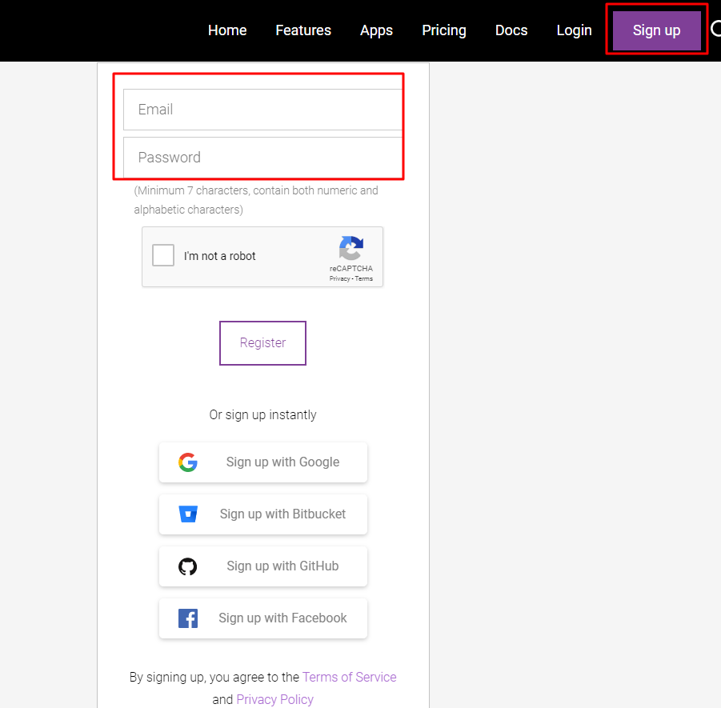
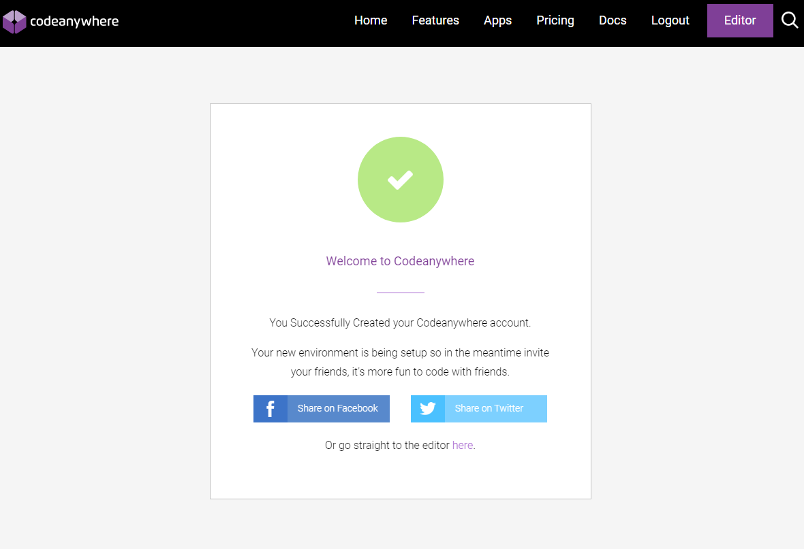

# Criando uma conta

O primeiro passo para utilizarmos o Codeanywhere é criar uma conta. Acesse o [site](https://codeanywhere.com/) e clique no link no botão e *"Sign up"* para se registrar, escola a opção de conta Free Trial. Você pode usar seu e-mail ou uma conta: Google, Bitbucket, GitHub ou Facebook. Recomendamos usar a opção de incluir um e-mail valido e senha.

# Valide seu e-mail

É necessário que você valide seu e-mail, então certifique-se de ter acesso a ele.

# Caso já tenha conta
Se loga aê e toca ficha :D
