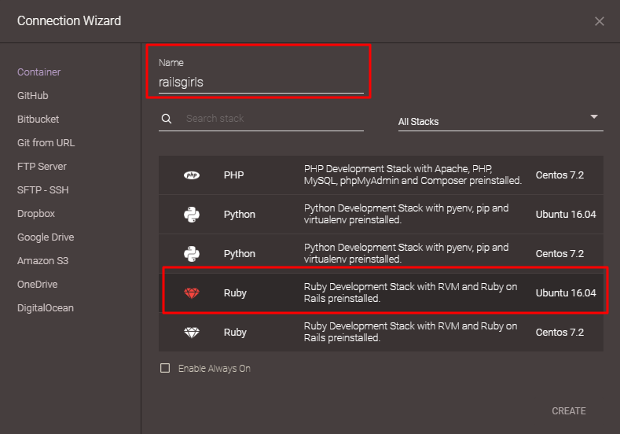

# Vamos aos nossos primeiros passo
Incialmente caso você nunca tenha mexido no codeanywhere essa será sua primeira tela.

# Criando o nosso container <3

Na janela do Connection Wizard, dê o nome "railsgirls" a seu projeto e use a caixa de busca (search stack) para pesquisar por *ruby*.

Para que tudo dê certinho, vamos nos certificar de escolher aquela que diz "Ruby" **e** "Ubuntu 16.04":

Após selecionar corretamente, clique em **"CREATE"** (você pode ter de usar a barra de rolagem para encontrar esse botão, que fica lá embaixo). Ele vai retornar a menssagem que está criando o seu container com as configurações anteriores.

Para fazer isso vamos no editor, clicando no botão **"Editor"**. Isso irá abrir o assistente de conexão _(Connection Wizard)_ - se isso não acontecer, você pode encontrá-lo em _File/New Connection/Container_.

# Caso você já tenha usado codeanywhere

Provavelmente você já tem algum container criado. Como é uma conta de graça, podemos criar apenas 1 container por vez. Precisamos primeiramente deletar o container já existente.
Clique com o botão direito do mouse em cima do nome do seu container e vai até a opção "Destroy"

